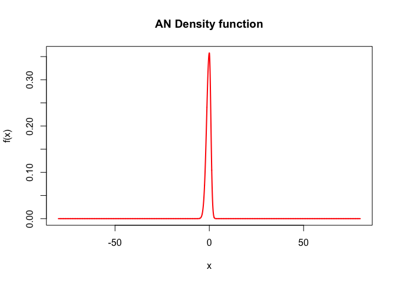
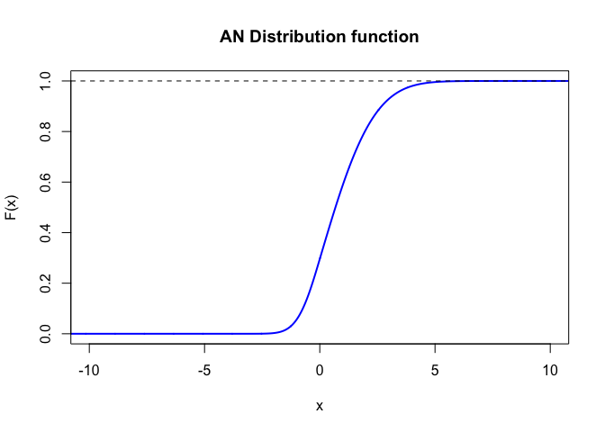

andistr package
================

<!-- README.md is generated from README.Rmd. Please edit that file -->

# andistr

<!-- badges: start -->
<!-- badges: end -->

The goal of “andistr” is to provide the density, distribution function,
quantile function, random number generator, likelihood function and
moments for a given sample, all this for the Three-Parameter Asymmetric
Normal Distribution defined in Gerlach and Chen (2015), Waldmann et al
(2017) and Philipps (2022) that elicits expectiles.

## Installation

You can install the development version of andistr from
[GitHub](https://github.com/) with:

``` r
# install.packages("devtools")
devtools::install_github("beatriceforoni/andistr")
```

## Example

This is a basic example which shows you how to solve a common problem:

``` r
library(andistr)
## Let's plot the Asymmetric Normal Distribution
##Density
library(andistr)
sseq = seq(-80,80,0.01)
dens = andistr:::dAND(y=sseq,mu=0,sigma=1,p=0.75)
plot(sseq,dens,type="l",lwd=2,col="red",xlab="x",ylab="f(x)",
      main="AN Density function")
```



``` r

## Distribution Function
df = andistr:::pAND(q=sseq,mu=0,sigma=1,p=0.15)
plot(sseq,df,type="l",lwd=2,col="blue",xlab="x",ylab="F(x)",
      main="AN Distribution function", xlim = c(-10,10))
abline(h=1,lty=2)
```


